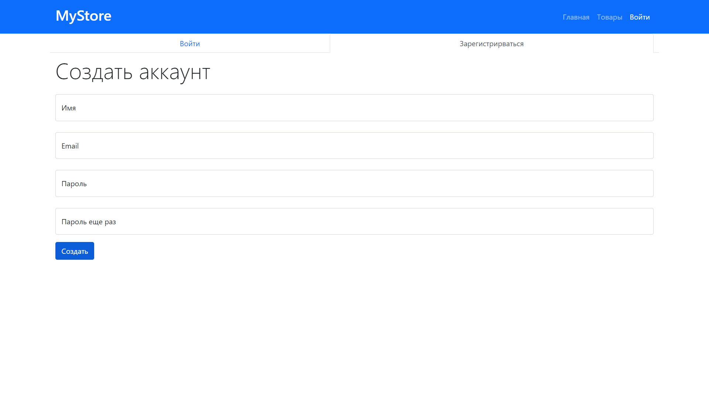
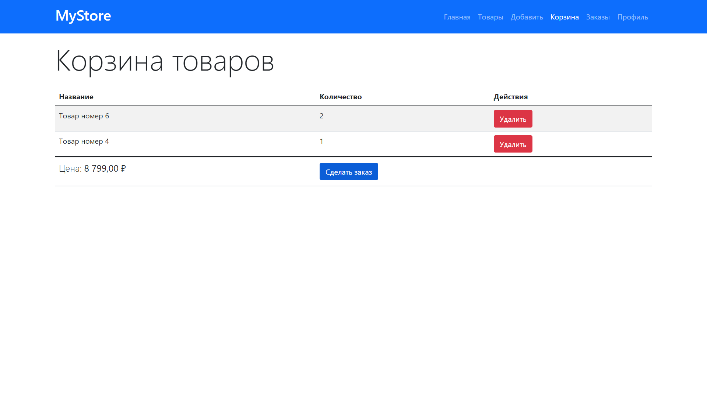

# MyStore

Приложение с функционалом интернет-магазина: аутентификация, админ-панель, база данных и т.д. Основной упор идет на функционал, нежели на UX/UI часть. Верстка полностью на bootsrap 5.
Каждый зарегистрировавшийся пользователь получет доступ к CRUD функционалу для манипулировании товарами (добавить товар, смотреть товары других пользователей, редактирвоать товар и удалить товар).

[Просмотр](https://mystore-fullstack.herokuapp.com/)

    
    

---

-   Различные манипуляции c данными и сервером:
    **CRUD (create, read, update, delete)**
-   В качестве базы данных использована **MongoDB**
-   Проект написан с учетом паттерна **MVC (model, view, controller)**
-   Стек `Handlebars, bootsrap 5, JavaScript, Node.js, Express.js, MongoDB, Mongoose`
